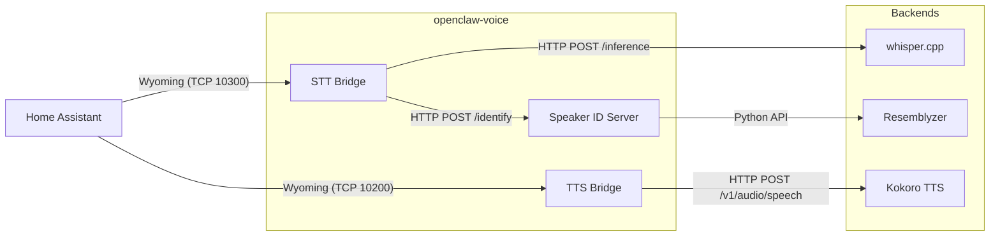

# Architecture

`openclaw-voice` provides a suite of bridges connecting the [Wyoming Protocol](https://github.com/rhasspy/wyoming) (used by Home Assistant Voice Assist) to local, privacy-focused AI models.

## High-Level Overview

## Components

### 1. STT Bridge (`stt_bridge.py`)
- **Protocol**: Wyoming (Server)
- **Role**: Receives raw audio chunks from Home Assistant, buffers them until `AudioStop`, then sends the complete WAV buffer to `whisper.cpp` for transcription.
- **Features**:
  - Parallel execution: Transcription and Speaker ID run concurrently.
  - Metadata injection: Prefixes transcripts with `[speaker:Name|conf:0.95]` for downstream LLM context.
  - JSONL logging: Writes transcripts to disk for episodic memory systems.

### 2. TTS Bridge (`tts_bridge.py`)
- **Protocol**: Wyoming (Server)
- **Role**: Advertises available voices and handles synthesis requests.
- **Flow**:
  1. Receives `Synthesize(text="Hello", voice="alloy")`.
  2. Maps voice alias (e.g., `alloy` → `af_heart`).
  3. POSTs JSON to Kokoro's OpenAI-compatible endpoint.
  4. Streams the response audio back to Home Assistant as Wyoming `AudioChunk` events.
- **Latency**: Critical path. Uses `httpx` async streaming to minimize time-to-first-audio-byte.

### 3. Speaker ID Server (`speaker_id.py`)
- **Protocol**: HTTP (FastAPI)
- **Role**: Manages speaker embeddings and identification.
- **Backend**: [Resemblyzer](https://github.com/resemble-ai/Resemblyzer) (d-vector embeddings).
- **Storage**: JSON files in `./speaker-profiles/`. Each file contains the speaker's name, embedding vector, and access level.
- **Enrollment**: Averages multiple audio samples to create a robust speaker profile.

## Data Flow

1. **Wake Word**: Detected on-device (satellite) or in Home Assistant (openWakeWord).
2. **Audio Stream**: HA opens a connection to STT Bridge (port 10300).
3. **Transcription**: STT Bridge sends audio to Whisper.
4. **Identification**: Simultaneously, STT Bridge sends audio to Speaker ID.
5. **Response**: STT Bridge merges text and speaker info: `[speaker:Liam] Turn on the lights.`
6. **Intent**: HA processes the text intent.
7. **Response Generation**: HA sends text response to TTS Bridge (port 10200).
8. **Synthesis**: TTS Bridge generates audio via Kokoro and streams it back to the satellite.
